# 首先 这个项目fork自https://github.com/sena-nana/nonebot-plugin-novelai
### 感谢 sena喵 感谢 sena喵 感谢 sena喵
因为懒得更改其他地方了，所以有不少nonebot-plugin-novelai的地方，凑合用就行(

# 支持中文关键词的基于nonebot2的stable-diffusion绘图插件支持多种webui插件和脚本以及更多玩法, 接入API, 支持白嫖绘图
### 插件讨论反馈群：687904502  
### 雕雕的银趴群：116994235 不会用或者想玩机器人都可以进来呀  

# 简要说明
推荐使用nonebot插件管理进行安装
```
nb plugin install nonebot-plugin-stable-diffusion-diao
```
```
需要redis来保证正常运行
windows用户请看,下载msi安装即可
https://github.com/MicrosoftArchive/redis/releases
成熟的linux用户会自己安装（
```

## 核心功能
- ## 开箱即用(使用本人API) / 或者设置token使用在线服务 
- ## 支持stable-diffusio-webui / stable-diffusio-webui-forge / comfyui (本人用的比较少, 如有需要完善请加群或者留个issue)
- ### ↓ 白嫖绘图, 人人有图画 ↓ 使用此项目
- ## 整合一个支持调用各种在线网站的多功能API (支持FASTAPI适配器) https://github.com/DiaoDaiaChan/Stable-Diffusion-DrawBridgeAPI
- ## [DrawBridgeAPI使用教程](docs/main/DrawBridgeAPI.md)
- ### 支持多后端负载均衡. 2种模式, 随机和加权随机, 以及你可以手动选择后端
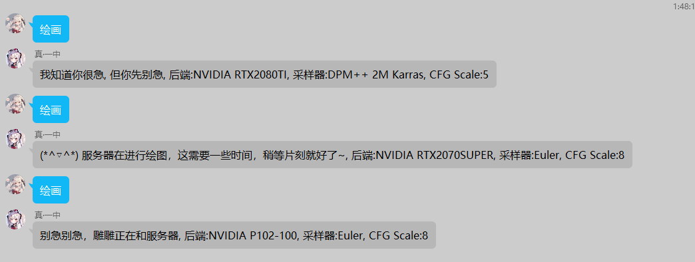
- ## 支持SD1.5, SDXL, FLUX, MJ(需要token), novelai (需要token, 但雕雕没有token来测试, 很久没有维护)
- ### 丰富的绘图自定义参数(高清修复, 采样器等等)
- ## 支持多种SD-API(打标, 超分, 更换模型, ,抠图, 更改webui设置等等)
- ## 支持stable-diffusio-webui的多种插件 (需要适配的插件请留言)
- - detailer
https://github.com/Bing-su/adetailer
- - negpip
https://github.com/hako-mikan/sd-webui-negpip
- - cutoff
https://github.com/hnmr293/sd-webui-cutoff
- - controlnet
https://github.com/Mikubill/sd-webui-controlnet
- - tagger
https://github.com/toriato/stable-diffusion-webui-wd14-tagger
- - rembg
https://github.com/AUTOMATIC1111/stable-diffusion-webui-rembg
- - Self Attention Guidance
https://github.com/ashen-sensored/sd_webui_SAG
- - DWPose
https://github.com/IDEA-Research/DWPose
- - Tiled Diffusion & VAE
https://github.com/pkuliyi2015/multidiffusion-upscaler-for-automatic1111
- - DTG
https://github.com/KohakuBlueleaf/z-a1111-sd-webui-dtg
- ### 自带图片(可选择本地, 下载模型使用CPU审核, 或者使用webui的tagger插件审核)/文字审核(需要openai token或者自建openai api)
- ### 多种涩涩图片处理模式 (不发送, 发送链接, 二维码, 私聊, 直接发送)
- ### 打标/llm打标
- ### ai 生成prompt
- ### 查看模型 [在这](#710-030更新)
- ### 生成绘画过程视频,已停止维护,感觉没啥用)))
- ### lora 和 emb模型调用
```
使用 -lora 模型1编号_模型1权重,模型2编号_模型2权重，例如 -lora 341_1,233_0.9
```
- ### 自动匹配功能, 例如你有一个名为 胡桃.safetensors 的LORA模型, 你只需要输入 绘画胡桃 就能匹配到这个模型 ( 胡桃 -> '<lora:胡桃:1>'), 以及下面匹配的提示词预设功能
- ### 提示词预设 [预设命令预览](#710-030更新)
- ### 从civitai搜索模型/下载模型到sd后端/运行模型 [C站更新](#87-041更新-更新c站httpscivitaicom搜索-下载模型功能)
- ### 支持为每个不同的后端单独设置参数(见配置项override_backend_setting), 比如请求到1号后端自动使用一套prompt和参数,2号后端又是另一套参数

- ### 后端  
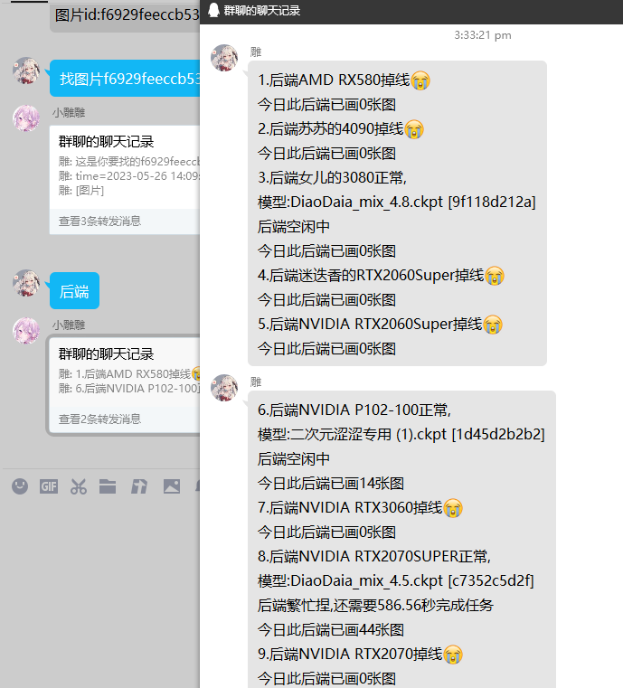  

二次元的我at人会以他的头像生成图片  
绘画@人也能生成那个人的头像的图片  
添加了更多的追踪信息  
还有挺多细节的更改就不一一列出力
敬请阅读下面的日志或者来雕雕的银趴玩(  
## ↓ 由于本插件是个较大项目, 所以请仔细阅读,指令示例, 快看快看快看, 一定要仔细看哦 ↓ 
###  当然, 如果想快速使用的本插件也是配置好了,可以开箱即用
### 发送 绘画帮助 , 获取详细帮助
[各种指令展示](nonebot_plugin_stable_diffusion_diao/extension/ADH.md)

#### 配置文件路径 机器人所在路径/config/novelai/config.yaml
[配置文件](nonebot_plugin_stable_diffusion_diao/config_example.yaml)  

### 注意, 需要配置SUPERUSER, 来获取图片链接
### 本人模型站链接, 请支持!))
https://huggingface.co/diaodiao/DiaoDaia_Mix
https://civitai.com/user/DiaoDaiaYoChan
https://www.liblib.art/userpage/af0c2d832e124f13836734243a9bb942/publish
# 更新日志
## 2024.09.24 0.5.3 更新
内建drawbridgeAPI, 没有显卡的小伙伴也能画图了, 默认监听 0.0.0.0:8000
```
dbapi_site: ["127.0.0.1", 8000]  # SD-DrawBridgeAPI地址以及端口
dbapi_conf_file: ./config/dbapi_config.yaml  # 配置文件路径
dbapi_build_in: true  # 启动内置的dbapi进行生图
```
推荐使用liblib AI !
新设置, 图片可以选择发送给superuser或者机器人本体
``` yaml
send_to_bot: true  # 涩图直接发给机器人本身(避免未配置superusers)
```
[DrawBridgeAPI使用教程](docs/main/DrawBridgeAPI.md)
## 2024.09.15 0.5.2 更新
新增配置项
```
ai_trans = false  # 当检测到中文输入的时候, 使用ai翻译/生成prompt
backend_type:  # 后端类型, 会自动根据后端类型修改post参数
  - 1.5
  - xl
  - flux
# 请按顺序修改后端类型, 比如
按照顺序对应
"雕雕的后端": "api.diaodiao.online:7860"
"雕雕的后端2": "api.diaodiao.online:7863"
"雕雕的后端3": "api.diaodiao.online:7864"
当请求到雕雕的后端2的时候, 自动切换为XL参数
当请求到雕雕的后端3的时候, 自动切换为FLUX参数
```
```
支持自然语言打标
使用项目: https://github.com/DiaoDaiaChan/Stable-Diffusion-DrawBridgeAPI
novelai_tagger_site:
指令: llm 
```
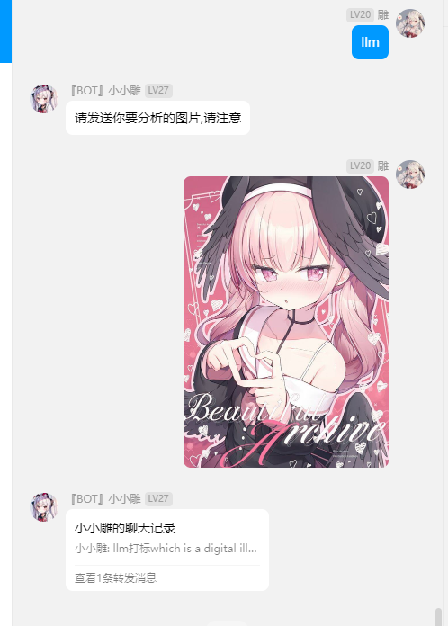  
```
支持内建tagger用于审核以及分析功能, 将 novelai_picaudit 设置为 2 即可使用
```
```
恢复多张生成功能, -b 为每批数量 -niter / -bc 为批数
config.novelai_max 一次能生成的最大数量
```
兼容pydantic v1 和 v2 (大概)
## 2024.07.02 0.5.1 更新
```
新增auto_dtg配置项，tag数量少于10个或者使用二次元的我时候自动调用dtg生成prompt
```
## 2024.06.28 0.5.0 更新
```
本插件适配SDXL
可以使用  模型列表vae_后端编号  来获取vae模型
修复了 新版controlnet的适配问题， civitai搜索问题
```
```
新的配置项目：
enalbe_xl 默认启用XL（不推荐开启）
xl_config 当使用XL生图时，使用的prompt和negative prompt以及vae模型
```
```
新的命令参数
-xl
-dtg 使用dtg插件补全tag https://github.com/KohakuBlueleaf/z-a1111-sd-webui-dtg

```

## 11.9 0.4.7.3更新
修复了C站模型搜索问题
```
新的命令参数
-bing 使用bing dalle3生图，需要获取cookie以及最好设置代理 proxy_site
bing_cookie：
- xxxxx
- xxxxxxxx2
```
bing cookie获取方式
https://github.com/acheong08/BingImageCreator
## 11.3 0.4.7更新
雕雕的api换地址辣
```
新的命令参数
-bs 本张图片使用指定的后端地址生图，例如：
绘画reimu -bs api.diaodiao.online:7860
-ai 使用chatgpt辅助生成tags
绘画海边的少女 -ai
```
```
新的特性：
更改了图片保存的目录结构 /群/日期/用户
还有挺多的小改进就不写了）
```
```
新的配置项目
is_trt_backend: false  # 是否有使用了TensorRT的后端(分辨率必须为64的倍数), 打开此设置之后,会自动更改分辨率和高清修复倍率
is_return_hash_info: false  # 是否返回图片哈希信息（避免被q群管家撤回）
no_wait_list: []  # 即发送绘画指令的时候机器人的响应文本
redis_host: ["127.0.0.1", 6379]  # redis地址和端口
```
## 10.4 0.4.6 更新
```
加快了处理的速度
审核API掉线的时候不会再发不出图啦
以图绘图, 帮我画, 二次元的我, 支持指令参数了
二次元的我 -r l
帮我画 -sp "Euler a"
现在只有机器人的主人可以释放显存
```
## 9.16 0.4.5.5更新
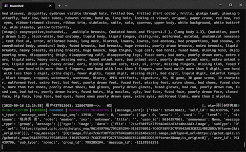 
```
新的特性，生图的时候会追踪生图进度
可见设置show_progress_bar
新增设置允许的最大步数
novelai_max_steps
```
```
即将更新后端跑分(自动设置后端权重)和图表功能（（
```
## 9.6 0.4.5更新
```
支持了cutoff和negpip插件(设置打开常驻功能)
cutoff插件减少关键词颜色污染
绘画white hair,blue eye,red dress -co white,blue,red
把出现在prompt中的颜色填到参数中即可
negpip可以提高对prompt的控制
绘画 1boy,(1girl:-1.8)  # 不生成女孩
```
```
支持使用controlnet inpaint进行扩图
绘画[图片] -otp --ar 21:9 -hr 1.2
扩图至21:9并且放大1.2倍
```
```
图生图现在可以使用放大了例如
绘画 [图片] -hr 1.2
放大1.2倍
```
## 9.2 0.4.4更新
分析@别人现在可以分析TA的头像了
```
新的命令参数 --ar
绘画miku --ar 16:9
绘画reimu --ar 1:1
直接使用画幅比例绘图
-sr参数更新
绘画miku -sr fast  # 使用普通超分在图片生成完成后超分
绘画miku -sr slow  # 使用分块超分进行超分， 需要ultimate sd upscale插件
```
## 8.29 0.4.3更新 使用了yaml配置文件路径为config/novelai/config.yaml
放弃使用.env文件配置,请以后在config.yaml中配置
```
可以使用mj生成二次元的我图片  
config.yaml里设置proxy地址后  
二次元的我/mj 即可  
mj功能来自 @noahzark 
```
```
绘画miku -sag  
使用Self Attention Guidance进行生图(能一定程度上提升图片质量) 
```  
## 8.29 0.4.2更新 可以是openpose的dwpose来生图
```
openpose = True
绘画miku -op
绘画miku --opsenpose
```
来进行control生图，大幅度降低肢体崩坏
添加了雕雕自建的翻译API
## 8.7 0.4.1更新 更新C站(https://civitai.com/)搜索, 下载模型功能!
注意 webui-forge有bug, 请使用原版webui
```
注意! 使用C站功能需要你手动创建文件夹
仓库里的 sd-webui-api 文件夹中的api.py放到以下目录(可以设置代理, 请留意代码第14行)
stable-diffusion-webui\extensions\civitai\scripts\
完成之后重启前端
```
```
如何获取C站搜索用的token?
打开C站官网 https://civitai.com/
按F12打开开发人员工具
```
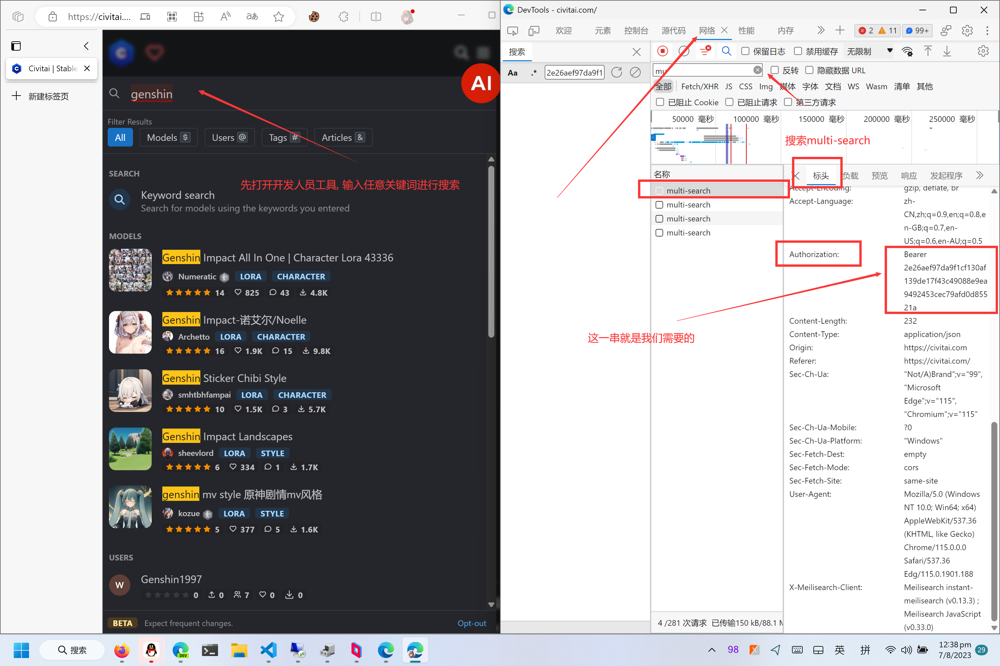
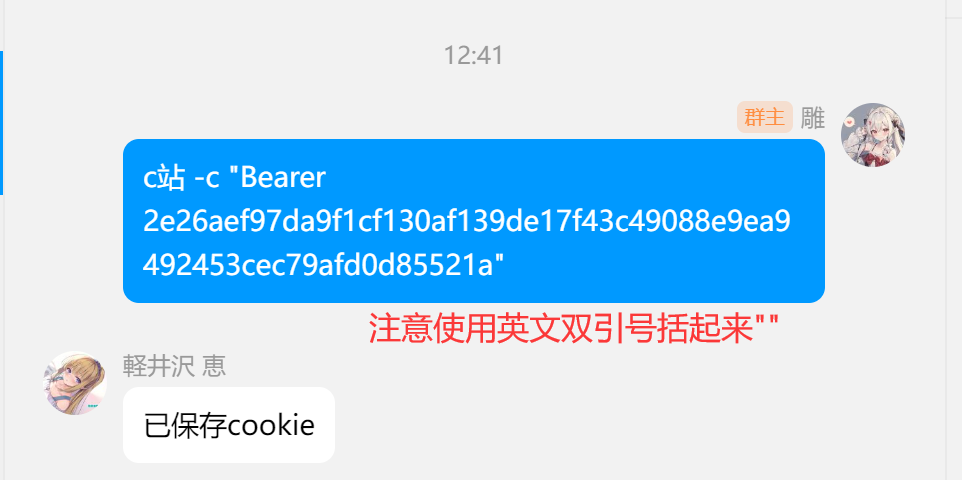
```
命令详解
c站
--limit, -l 搜索时匹配到的模型数量默认为1, 可以自行设置
-d, -下载 下载指定模型
-s, -搜索 搜索指定模型
-c, 设置c站cookie
-sd, 选择后端
-run, 下载完成模型立即生图, 小tips, 你的lora模型之类的太多的话, 刷新模型会卡住不少时间
请仔细看图
下载完成后后端会自动重载模型列表, 不行的话请发送  刷新模型  命令手动执行
```
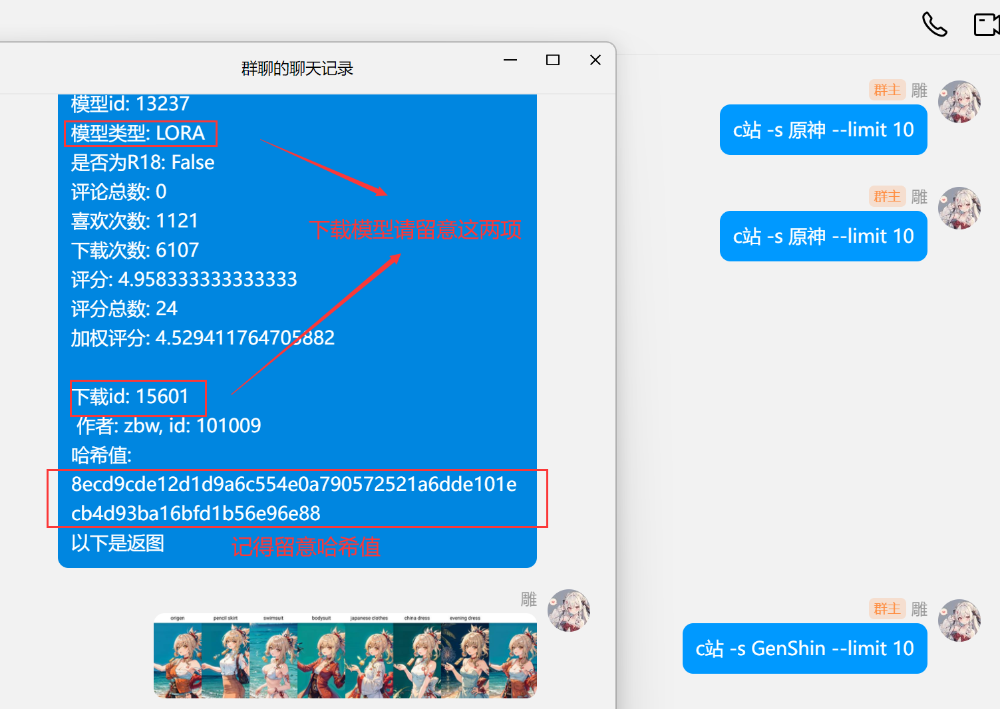
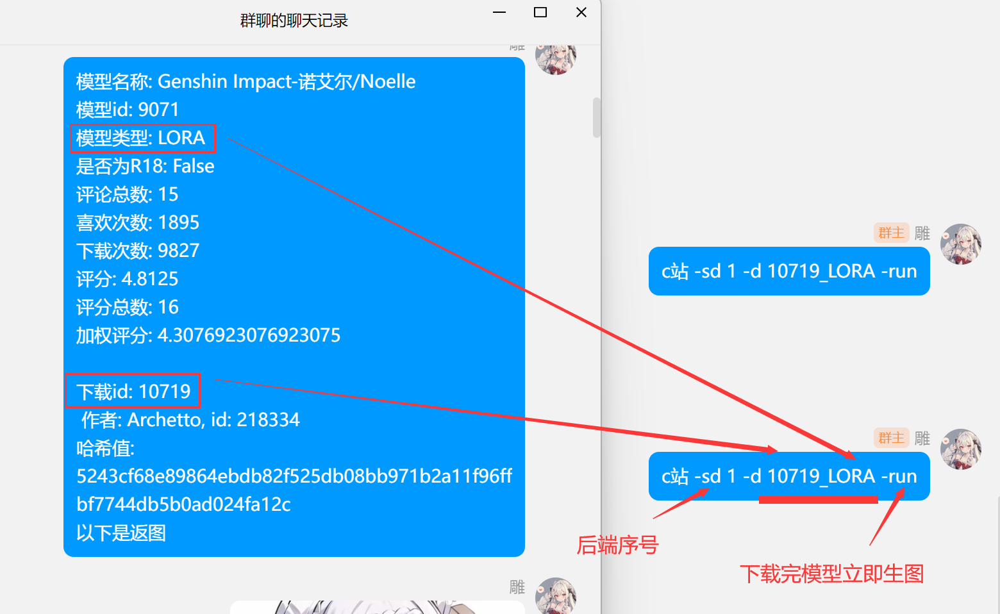
```
新的设置项目 proxy_site = "" 例: "http://127.0.0.1:7860"
```
## 8.5 0.4 更新
```
新的命令
获取脚本(没雕用, 应该没人会去用吧)
```
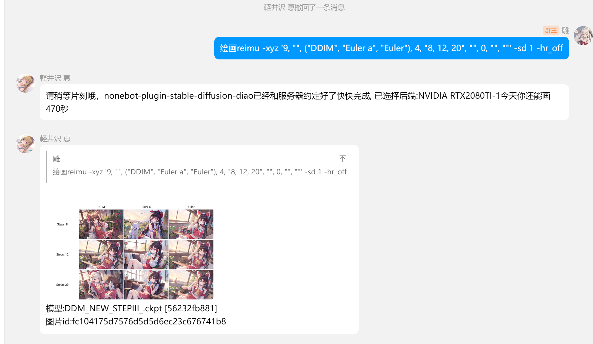
```
新的参数
-xyz 请严格按照以下格式, 一个标点不能错!
'整数, 字符串, 元组'
绘画reimu -xyz '9, "", ("DDIM", "Euler a", "Euler"), 4, "8, 12, 20", "", 0, "", ""' -sd 1 
分为三段, 分别为xyz轴, 每条轴3个参数
第一位为数字, 为脚本索引(请去webui看, 或者使用获取脚本命令来查看)0为不使用本条轴
第二位为字符串, 具体如何使用请查看webui, 例如步数, prompt等是手动填写参数, 故填写第二个参数, 例如步数
第三位为元组, 当此项参数为可以由webui自动填写的时候填写, 例如采样器
以上命令解释为
绘画 x轴为采样器(第一位为9)轴, y轴为步数(第一位为4)轴的xyz图标, 不使用z轴(第一位为0)
```
```
现在可以使用绘画所用的时间来计算点数设置为
novelai_daylimit_type = 2
-e 参数现在能控制高清修复的重绘幅度
```
## 7.30 0.3.9.8
```
新的命令:
刷新模型
终止生成 终止生成1
```
```
新的命令后缀 -td
尝试使用tileddiffusion进行绘图
-m 暂时更换模型命令现支持匹配模型名称
```
## 7.25 0.3.9.7
### 请注意! 如果后端开启了冻结设置选项, 更改任何设置均会失效, 下面的两个功能就可能用不了了
```
新的命令:
随机模型/随机出图   (随机挑选随机后端的随机模型生成使用随机prompt的图, 主打就是一个随机)
随机模型nahiida (随机挑选随机后端的随机模型生成使用nahiida prompt)
```
```
现在更换模型有两种模式
1. 使用  绘画 -sd 1 -m 2 来指定 (-sd为后端索引, 从0开始, -m 为模型序号) 此命令为仅本张图片使用此模型绘图
2. 更换模型1_2 为后端永久更换模型
```
```
vits -get 修复
添加了设置项, 是否只有超级用户才能更换模型
```
## 7.20 0.3.9.4
### 当你仅发送绘画(指令)的时候会返回随机tag
```
帮助菜单更新
修复一些BUG
新的设置项
```
#### 顺带一提tagger插件请使用 https://github.com/toriato/stable-diffusion-webui-wd14-tagger
新版的有bug
```
openai_proxy_site = "api.openai.com"  # 如果你想使用代理的openai api 填写这里 
tagger_model = "wd14-vit-v2-git"  # 分析功能, 审核功能使用的模型
```
## 7.10 0.3.0更新!
### 本次更新之后大部分功能需要redis, 不用的话也能正常启动
顺带一提百度云审核功能暂时用不了了,先别用它  
### 添加预设功能(需要redis)
```
# 预设功能,绘图时tag带有预设名字即可自动调用
预设  # 返回所有的预设
预设maid,red_eye,white_hair -n "女仆" -u "负面提示词"  # 添加名为女仆的预设正面提示词为"maid,red_eye,white_hair"
预设 -f "女仆"  # 查找名为女仆的预设
预设 -d "女仆"  # 删除名为女仆的预设
# 绘图女仆  插件检测到 "女仆" 即自动等于  绘图maid,red_eye,white_hair
```
### 再来一张功能(需要redis)
```
发送  再来一张
```
### 两种负载均衡模式
```
敬请查看 
novelai_load_balance_mode = 1  # 负载均衡模式, 1为随机, 2为加权随机选择
当你需要加权随机的时候请填写
novelai_load_balance_weight = []
假如你有4个后端
我想要1号后端多工作一些,4号后端少工作一些,可以
novelai_load_balance_weight = [0.5, 0.2, 0.2, 0.1]
这样,当所有后端空闲的时候,会有50%的概率选择到1号后端,10%选择到4号后端(会动态调整假如有后端掉线)
```
### 模糊匹配emb和lora(需要redis)
如图所示
每次画图会自动匹配是否有lora或者嵌入式模型可用
auto_match = False  以关闭
或者使用 -match_off 参数 关闭一次
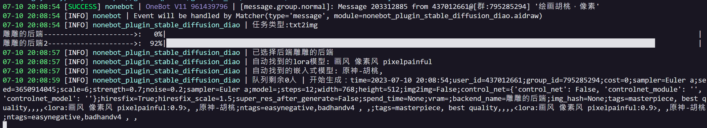
### 优化lora和emb
```
lora  # 1号后端的lora模型
emb  # 1号后端的嵌入式模型
lora原  # 查找1号后端名字里带有原的模型
lora2_原  # 查找3号后端名字里带有原的模型
# emb 同理
```
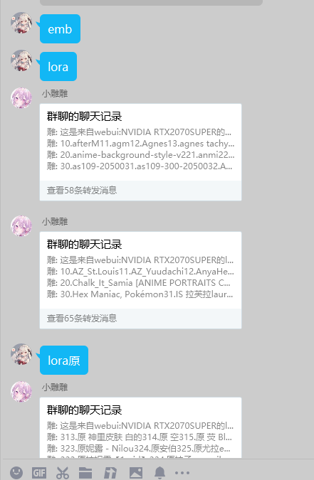
### 手动重载模型
```
释放显存0  # 释放1号后端的模型
释放显存1  # 释放2号后端的模型
```
### 找图片
```
图片生成完毕后有哈希值,可以用它来找到图片的追踪信息
找图片8b5a1dab8efee6928a560656a34642a1
```
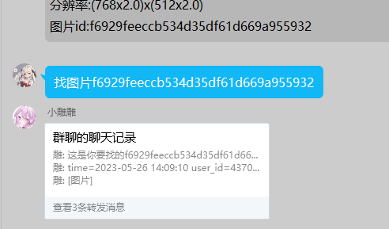  

### 手动指定图片审核功能
```
审核 [图片]
[回复有图片的消息] 审核
```
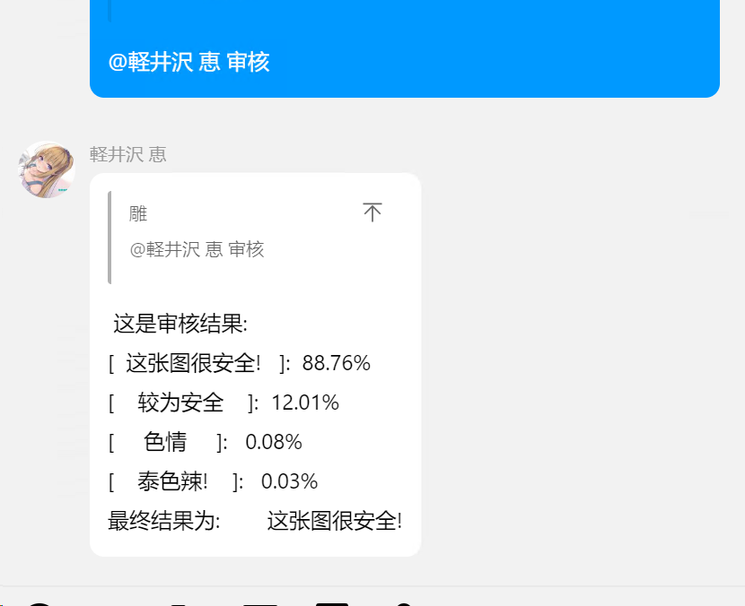  
### 一些新的小特性
```
后端添加查看显存占用
群共享cd 
撤回额外消息
```
## 7.3
现在本插件自带后端啦
现在不需要任何配置就能画图
更新了个进度条(
修复了一些bug
## 5.30
私聊画的图片不在审核
VITS功能
修复每日次数不会清零的错误
## 5.25
指定更换后端模型和获取指定后端的模型  
模型列表0 (查看0号后端的模型)  
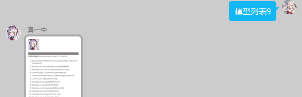    
更换模型0_1 (为0号后端更换1号模型)  
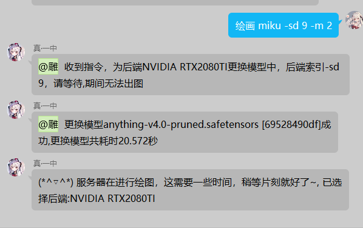 
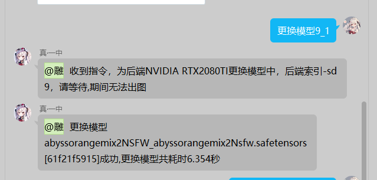   
可以使用webui的tagger功能了（需要安装tagger插件）设置 config.novelai_tagger_site  
(tagger的CPU推理速度也不慢，你也可以使用CPU，这样就不会占用显存辣)  
## 5.23
后端指令现在可以显示所有后端的模型  
优化了负载均衡的logger  
## 5.22
应家人要求添加了新的二次的我的功能 
## 5.14
所有生成图片接入图片审核 # 需要设置  
新增新的审核api  
统计词频  
随机prompt画图  
所有功能支持私聊（二次元的我，帮我画，以图绘图）(大概  
更改了一些代码  
## 5.11
为所有生图功能添加了次数限制，图片URL可以自动转为二维码发送  
帮助文档小更新  
一些小小的特性升级 
## 5.7
支持私聊  
自动调整高清修复倍率  
负载均衡更新  
更新了一些R18屏蔽词  
现在可以手动指定高清修复倍率 -hr 2.5 or -hr 2  
关闭高清修复 -hr_off  
添加翻译功能 例如： 翻译女仆 
## 5.1更新
添加了随机采样器，CFG Scale，画幅比例功能  
添加了失效自动重试功能  
在后端炸显存能尝试自动卸载模型并且重新加载  
添加了高清修复功能  
添加了图片生成后的超分功能 
（这个功能开启后，当图片生成完成，会再次使用webui的API对图片进行一次超分，让图片清晰度更高，不过对后端也是压力很大 config.novelai_SuperRes_generate）  
添加了controlnet以图生图功能  
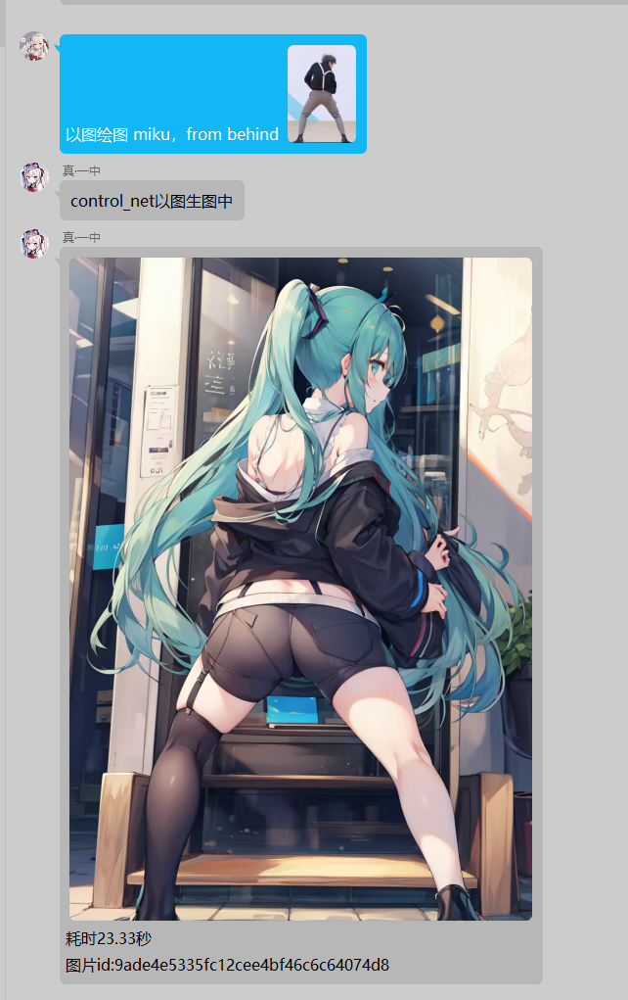  
添加了图片审核功能，可选本地或者百度云  
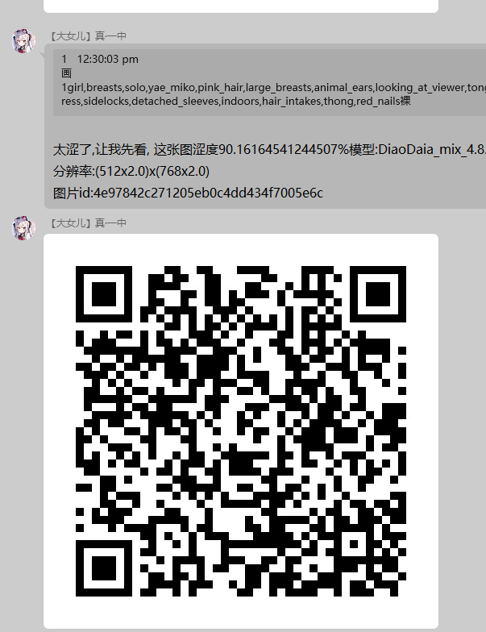  
添加了检测到涩图后的处理方式，可以返回图片URL到群聊  
添加了两个娱乐功能 二次元的我 和 chatgpt prompt 生成功能
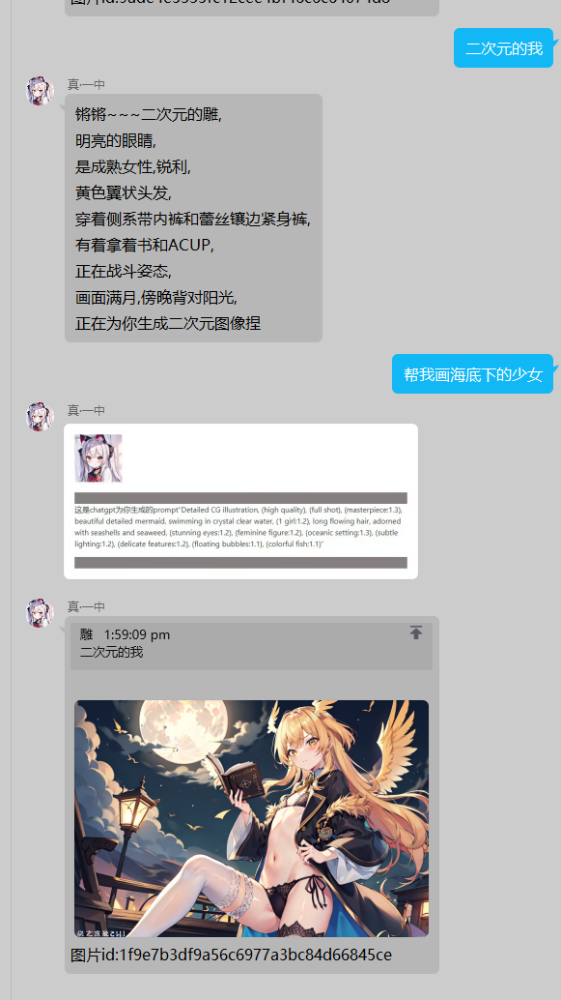  
添加了百度翻译  
添加了新的帮助菜单  
添加了风控功能，让你的G7人即使被疯狂风控也能发出来消息(  
更多的群聊设置 # 敬请仔细阅读 绘画帮助  菜单  
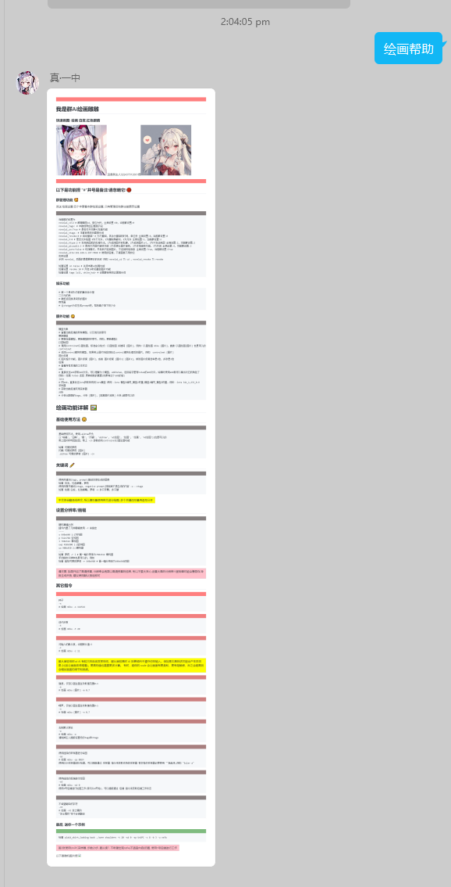  

## 咕咕
绘画[哈希值]
联想
群内更改设置, 转到redis

## 已经修复的BUG
### 7.16 version: "0.3.9.3
```
添加了 抠图 读图
两个命令
```
### 7.12 version: 0.3.3  
```
修复了手动选择后端的时候emb等不能正确匹配的问题
修复了后端掉线后无法自动重新加载emb, lora的问题
```