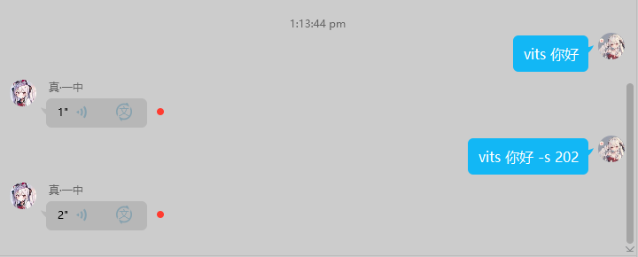

# 首先 这个项目fork自https://github.com/sena-nana/nonebot-plugin-novelai
## 感谢 sena喵 感谢 sena喵 感谢 sena喵
因为懒得更改其他地方了，所以有不少nonebot-plugin-novelai的地方，凑合用就行(

# 支持中文关键词的基于nonebot2的AI绘图插件
插件讨论反馈群：687904502  
雕雕的银趴群：116994235 不会用或者想玩机器人都可以进来呀  
说明书：https://nb.novelai.dev

环境需求：
- Python>=3.8
- nonebot2>=b4
- 生成图片需要nonebot-plugin-htmlrender
## 依赖
aiohttp,aiofiles

# 简要说明
## 由于雕雕比较菜，所以请时常检查更新(
## 本插件不配置插件也能正常启动，自带后端配置即开即用 
## 你需要启动了API的stable-diffusion-webui才能画图，**！文档的最后有.env文件配置模板！**
### 雕主要是为stable-diffusion-webui更新了功能，novalai官方，naifu没动过，理论上也能工作，不过推荐使用本插件只使用sdwebui(

## 指令示例
#### 温馨提示!很长的tag建议使用""括起来, 否则容易解析错误, 例如 绘画"(((Masterpiece))),(((best quality))),(detailed and Beautiful Eyes:1.3),1girl,solo,(brown color low twintails:1.3),(shushing),(half body),(serafuku:1.2), long sleeves,plaid skirt,(white color socks:1.2), blue_eye, Hair Between Eyes, very long hair, choker,hair bow,wristband,head tilt, naughty ,strip,earrings,light blush,medium breasts, medium_wind,floating hair"
.aidraw loli,cute --ntags big breast --seed 114514
- 指令使用shell解析输入的参数
- square为指定画幅，支持简写为s，其他画幅为portrait和landscape，同样支持简写，默认为portrait
- seed若省略则为自动生成
- 词条使用英文，使用逗号（中英都行，代码里有转换）分割，中文会自动机翻为英文，不支持其他语种
- 如果你不想用.aidraw，可以用 **绘画** 、 **咏唱** 或 **召唤** 代替。
- 在消息中添加图片或者回复带有图片的消息自动切换为以图生图模式


.aidraw on/off
- 启动/关闭本群的aidraw

.tagget [图片]
- 获取图片的TAG
- 如果你不想用.tagget，可以用 **鉴赏** 或 **查书** 代替。
## 其他花里胡哨的功能
VITS(https://github.com/Artrajz/vits-simple-api) # 正在编写
## 相比于原本的nonebot-plugin-novelai更新了甚么？
删除批量生成功能  
添加了sd负载均衡功能

## 添加了以下命令
VITS  
vits 你好  
vits -get # 获取支持的音色  
vits 你好 -s 202 使用202号音色  
  
二次元的我  
帮我画 # chatgpt prompt 生成功能 后面跟上你想画的东西  
绘画帮助  
更换模型  
模型列表  
以图绘图  
controlnet  
图片修复 # 就是图片超分功能辣 
翻译  
后端 # 获取所有后端状态  
emb  
lora
  
采样器  
设置 # 可以通过机器人更改webui的设置  
后端  
  
###新的命令后缀

-sd 选择后端，数字索引从0开始 -sd 0   
-sp 选择采样器，可以通过发送 “采样器” 来获取后端支持的采样器  
-nt 不需要翻译的字符串，例如 绘画 miku,blushing -nt <lora:坤坤:0.5>  
-cn 仅在以图生图生效，使用controlnet生图，例如 绘画 miku [图片] -cn  
-hr_off 生成次图片的时候关闭高清修复功能  
-emb 使用的emb，数字索引，索引从1开始 -emb 1  
-lora 使用的lora，数字索引 -lora 1    
-m 1 指定模型  
-hr 2.5 or -hr 2 手动指定高清修复倍率 
-sr 参数可以手动打开图片生成后超分功能
-match_off 关闭prompt自动匹配功能 

二次元的我at人会以他的头像生成图片  
绘画@人也能生成那个人的头像的图片  
添加了更多的追踪信息  
还有挺多细节的更改就不一一列出力
敬请阅读下面的日志或者来雕雕的银趴玩(  

# 更新日志
## 8.7 0.4.1更新 更新C站(https://civitai.com/)搜索, 下载模型功能!
```
注意! 使用C站功能需要你手动创建文件夹
仓库里的 sd-webui-api 文件夹中的api.py放到以下目录(可以设置代理, 请留意代码第14行)
stable-diffusion-webui\extensions\civitai\scripts\
完成之后重启前端
```
```
如何获取C站搜索用的token?
打开C站官网 https://civitai.com/
按F12打开开发人员工具
```


```
命令详解
c站
--limit, -l 搜索时匹配到的模型数量默认为1, 可以自行设置
-d, -下载 下载指定模型
-s, -搜索 搜索指定模型
-c, 设置c站cookie
-sd, 选择后端
-run, 下载完成模型立即生图, 小tips, 你的lora模型之类的太多的话, 刷新模型会卡住不少时间
请仔细看图
下载完成后后端会自动重载模型列表, 不行的话请发送  刷新模型  命令手动执行
```


```
新的设置项目 proxy_site = "" 例: "http://127.0.0.1:7860"
```
## 8.5 0.4 更新
```
新的命令
获取脚本(没雕用, 应该没人会去用吧)
```

```
新的参数
-xyz 请严格按照以下格式, 一个标点不能错!
'整数, 字符串, 元组'
绘画reimu -xyz '9, "", ("DDIM", "Euler a", "Euler"), 4, "8, 12, 20", "", 0, "", ""' -sd 1 
分为三段, 分别为xyz轴, 每条轴3个参数
第一位为数字, 为脚本索引(请去webui看, 或者使用获取脚本命令来查看)0为不使用本条轴
第二位为字符串, 具体如何使用请查看webui, 例如步数, prompt等是手动填写参数, 故填写第二个参数, 例如步数
第三位为元组, 当此项参数为可以由webui自动填写的时候填写, 例如采样器
以上命令解释为
绘画 x轴为采样器(第一位为9)轴, y轴为步数(第一位为4)轴的xyz图标, 不使用z轴(第一位为0)
```
```
现在可以使用绘画所用的时间来计算点数设置为
novelai_daylimit_type = 2
-e 参数现在能控制高清修复的重绘幅度
```
## 7.30 0.3.9.8
```
新的命令:
刷新模型
终止生成 终止生成1
```
```
新的命令后缀 -td
尝试使用tileddiffusion进行绘图
-m 暂时更换模型命令现支持匹配模型名称
```
## 7.25 0.3.9.7
### 请注意! 如果后端开启了冻结设置选项, 更改任何设置均会失效, 下面的两个功能就可能用不了了
```
新的命令:
随机模型/随机出图   (随机挑选随机后端的随机模型生成使用随机prompt的图, 主打就是一个随机)
随机模型nahiida (随机挑选随机后端的随机模型生成使用nahiida prompt)
```
```
现在更换模型有两种模式
1. 使用  绘画 -sd 1 -m 2 来指定 (-sd为后端索引, 从0开始, -m 为模型序号) 此命令为仅本张图片使用此模型绘图
2. 更换模型1_2 为后端永久更换模型
```
```
vits -get 修复
添加了设置项, 是否只有超级用户才能更换模型
```
## 7.20 0.3.9.4
### 当你仅发送绘画(指令)的时候会返回随机tag
```
帮助菜单更新
修复一些BUG
新的设置项
```
#### 顺带一提tagger插件请使用 https://github.com/toriato/stable-diffusion-webui-wd14-tagger
新版的有bug
```
openai_proxy_site = "api.openai.com"  # 如果你想使用代理的openai api 填写这里 
tagger_model = "wd14-vit-v2-git"  # 分析功能, 审核功能使用的模型
```
## 7.10 0.3.0更新!
### 本次更新之后大部分功能需要redis, 不用的话也能正常启动
顺带一提百度云审核功能暂时用不了了,先别用它  
### 添加预设功能(需要redis)
```
# 预设功能,绘图时tag带有预设名字即可自动调用
预设  # 返回所有的预设
预设maid,red_eye,white_hair -n "女仆" -u "负面提示词"  # 添加名为女仆的预设正面提示词为"maid,red_eye,white_hair"
预设 -f "女仆"  # 查找名为女仆的预设
预设 -d "女仆"  # 删除名为女仆的预设
# 绘图女仆  插件检测到 "女仆" 即自动等于  绘图maid,red_eye,white_hair
```
### 再来一张功能(需要redis)
```
发送  再来一张
```
### 两种负载均衡模式
```
敬请查看 
novelai_load_balance_mode = 1  # 负载均衡模式, 1为随机, 2为加权随机选择
当你需要加权随机的时候请填写
novelai_load_balance_weight = []
假如你有4个后端
我想要1号后端多工作一些,4号后端少工作一些,可以
novelai_load_balance_weight = [0.5, 0.2, 0.2, 0.1]
这样,当所有后端空闲的时候,会有50%的概率选择到1号后端,10%选择到4号后端(会动态调整假如有后端掉线)
```
### 模糊匹配emb和lora(需要redis)
如图所示
每次画图会自动匹配是否有lora或者嵌入式模型可用
auto_match = False  以关闭
或者使用 -match_off 参数 关闭一次

### 优化lora和emb
```
lora  # 1号后端的lora模型
emb  # 1号后端的嵌入式模型
lora原  # 查找1号后端名字里带有原的模型
lora2_原  # 查找3号后端名字里带有原的模型
# emb 同理
```
### 手动重载模型
```
释放显存0  # 释放1号后端的模型
释放显存1  # 释放2号后端的模型
```
### 找图片
```
图片生成完毕后有哈希值,可以用它来找到图片的追踪信息
找图片8b5a1dab8efee6928a560656a34642a1
```
  

### 手动指定图片审核功能
```
审核 [图片]
[回复有图片的消息] 审核
```
  
### 一些新的小特性
```
后端添加查看显存占用
群共享cd 
撤回额外消息
```
## 7.3
现在本插件自带后端啦
现在不需要任何配置就能画图
更新了个进度条(
修复了一些bug
## 5.30
私聊画的图片不在审核
VITS功能
修复每日次数不会清零的错误
## 5.25
指定更换后端模型和获取指定后端的模型  
模型列表0 (查看0号后端的模型)  
    
更换模型0_1 (为0号后端更换1号模型)  
 
   
可以使用webui的tagger功能了（需要安装tagger插件）设置 config.novelai_tagger_site  
(tagger的CPU推理速度也不慢，你也可以使用CPU，这样就不会占用显存辣)  
## 5.23
后端指令现在可以显示所有后端的模型  
优化了负载均衡的logger  
## 5.22
应家人要求添加了新的二次的我的功能 
## 5.14
所有生成图片接入图片审核 # 需要设置  
新增新的审核api  
统计词频  
随机prompt画图  
所有功能支持私聊（二次元的我，帮我画，以图绘图）(大概  
更改了一些代码  
## 5.11
为所有生图功能添加了次数限制，图片URL可以自动转为二维码发送  
帮助文档小更新  
一些小小的特性升级 
## 5.7
支持私聊  
自动调整高清修复倍率  
负载均衡更新  
更新了一些R18屏蔽词  
现在可以手动指定高清修复倍率 -hr 2.5 or -hr 2  
关闭高清修复 -hr_off  
添加翻译功能 例如： 翻译女仆 
## 5.1更新
添加了随机采样器，CFG Scale，画幅比例功能  
添加了失效自动重试功能  
在后端炸显存能尝试自动卸载模型并且重新加载  
添加了高清修复功能  
添加了图片生成后的超分功能 
（这个功能开启后，当图片生成完成，会再次使用webui的API对图片进行一次超分，让图片清晰度更高，不过对后端也是压力很大 config.novelai_SuperRes_generate）  
添加了controlnet以图生图功能  
  
添加了图片审核功能，可选本地或者百度云  
  
添加了检测到涩图后的处理方式，可以返回图片URL到群聊  
添加了两个娱乐功能 二次元的我 和 chatgpt prompt 生成功能
  
添加了百度翻译  
添加了新的帮助菜单  
添加了风控功能，让你的G7人即使被疯狂风控也能发出来消息(  
更多的群聊设置 # 敬请仔细阅读 绘画帮助  菜单  
  

## 咕咕
绘画[哈希值]
联想
群内更改设置, 转到redis

## 已经修复的BUG
### 7.16 version: "0.3.9.3
```
添加了 抠图 读图
两个命令
```
### 7.12 version: 0.3.3  
```
修复了手动选择后端的时候emb等不能正确匹配的问题
修复了后端掉线后无法自动重新加载emb, lora的问题
```


## .env配置模板 如果.env配置麻烦，直接更改config.py文件也是可以的
## 喂喂 按需复制啊，不要一股脑复制到.env文件啊啊啊啊啊
### 你应该自己配置的配置项, 现在不配置也能运行惹,本插件自带后端,不过为了保险起见建议加上一个自己的 
```python
# 只支持sd
novelai_backend_url_dict = {"1号": "127.0.0.1:7860", "2号后端": "127.0.0.1:7860", "3号后端": "127.0.0.1:7860", "4号后端": "127.0.0.1:7860"} # 以此类推
```

### 常用配置项
```python
novelai_steps = 12 # 迭代步数
novelai_command_start = {"绘画", "咏唱", "召唤", "约稿", "aidraw", "画", "绘图", "AI绘图", "ai绘图"} # 插件响应你的这些命令  
novelai_daylimit = 20204 # 每个人每天能画多少图
novelai_h = 1  # 是否允许H, 0为不允许, 1为删除屏蔽词, 2允许
novelai_htype = 2 # 1为发现H后私聊用户返回图片, 2为返回群消息但是只返回图片url并且主人直接私吞H图(, 3发送二维码(无论参数如何都会保存图片到本地)
novelai_cd = 60  # 默认的cd
novelai_random_ratio = True # 是否开启随机比例
novelai_random_sampler = True # 是否开启随机采样器
novelai_random_scale = True # 是否开启随机CFG
#以下三项为加权随机
novelai_random_ratio_list = [("p", 0.35), ("s", 0.10), ("l", 0.35), ("uw", 0.1), ("uwp", 0.1)] # 随机图片比例 
novelai_random_sampler_list = [("Euler a", 0.25), ("Euler", 0.1), ("UniPC", 0.05), ("DDIM", 0.1), ("DPM++ 2S a Karras", 0.15), ("DPM++ SDE", 0.05), ("DPM++ 2S a", 0.1), ("DPM++ SDE Karras", 0.05), ("DPM++ 2M Karras", 0.15)] # 随机采样器
novelai_random_scale_list = [(3, 0.05), (4, 0.2), (5, 0.05), (6, 0.4), (7, 0.1), (8, 0.18), (9, 0.02)] # 随机 CFG Scale
novelai_picaudit = 4 # 1为百度云图片审核, 2为本地审核功能, 请去百度云免费领取 https://ai.baidu.com/tech/ 3为关闭 4为sdwebui tagger 插件审核
novelai_size_org = 640 # 最大分辨率 8G显存这个分辨率差不多辣
```

### 完全配置项
请注意,不要全部无脑复制
记得更改  
novelai_steps: int = None 改为
novelai_steps = None
```python
    novelai_steps: int = None  # 默认步数
    novelai_command_start: set = {"绘画", "咏唱", "召唤", "约稿", "aidraw", "画", "绘图", "AI绘图", "ai绘图"}
    novelai_scale: int = 7  # CFG Scale 请你自己设置, 每个模型都有适合的值
    novelai_retry: int = 4  # post失败后重试的次数
    novelai_token: str = ""  # 官网的token
    # novelai: dict = {"novelai":""}# 你的服务器地址（包含端口），不包含http头，例:127.0.0.1:6969
    novelai_mode: str = "sd"
    novelai_site: str = "la.iamdiao.lol:5938"
    # 后台设置
    novelai_save: int = 2  # 是否保存图片至本地,0为不保存，1保存，2同时保存追踪信息
    novelai_save_png: bool = False  # 是否保存为PNG格式
    novelai_paid: int = 3  # 0为禁用付费模式，1为点数制，2为不限制
    novelai_pure: bool = True  # 是否启用简洁返回模式（只返回图片，不返回tag等数据）
    novelai_limit: bool = False  # 是否开启限速
    novelai_daylimit: int = 24  # 每日次数限制，0为禁用
    novelai_h: int = 2  # 是否允许H, 0为不允许, 1为删除屏蔽词, 2允许
    novelai_htype: int = 3  # 1为发现H后私聊用户返回图片, 2为返回群消息但是只返回图片url并且主人直接私吞H图(, 3发送二维码(无论参数如何都会保存图片到本地)
    novelai_antireport: bool = True  # 玄学选项。开启后，合并消息内发送者将会显示为调用指令的人而不是bot
    novelai_max: int = 3  # 每次能够生成的最大数量
    # 允许生成的图片最大分辨率，对应(值)^2.默认为1024（即1024*1024）。如果服务器比较寄，建议改成640（640*640）或者根据能够承受的情况修改。naifu和novelai会分别限制最大长宽为1024
    # 可运行更改的设置
    novelai_tags: str = ""  # 内置的tag
    novelai_ntags: str = ""  # 内置的反tag
    novelai_cd: int = 60  # 默认的cd
    novelai_group_cd: int = 3  # 默认的群共享cd
    novelai_on: bool = True  # 是否全局开启
    novelai_revoke: int = 0  # 是否自动撤回，该值不为0时，则为撤回时间
    novelai_random_ratio: bool = True  # 是否开启随机比例
    novelai_random_sampler: bool = False  # 是否开启随机采样器
    novelai_random_scale: bool = False  # 是否开启随机CFG
    novelai_random_ratio_list: list =  [("p", 0.55), ("s", 0.1), ("l", 0.2), ("uw", 0.05), ("uwp", 0.1)] # 随机图片比例
    novelai_random_sampler_list = [("Euler a", 0.35), ("DDIM", 0.3), ("DPM++ 2S a Karras", 0.05), ("DPM++ 2M Karras", 0.3)]
    novelai_random_scale_list = [(3, 0.05), (4, 0.2), (5, 0.05), (6, 0.4), (7, 0.1), (8, 0.18), (9, 0.02)]
    novelai_load_balance: bool = True  # 负载均衡, 使用前请先将队列限速关闭, 目前只支持stable-diffusion-webui, 所以目前只支持novelai_mode = "sd" 时可用, 目前已知问题, 很短很短时间内疯狂画图的话无法均匀分配任务
    novelai_load_balance_mode: int = 1  # 负载均衡模式, 1为随机, 2为加权随机选择
    novelai_load_balance_weight: list = []  # 设置列表, 列表长度为你的后端数量, 数值为随机权重, 例[0.2, 0.5, 0.3]
    novelai_backend_url_dict: dict = {"雕雕的后端": "la.iamdiao.lol:5938", "雕雕的后端2": "la.iamdiao.lol:1521"} # 你能用到的后端, 键为名称, 值为url, 例:backend_url_dict = {"NVIDIA P102-100": "192.168.5.197:7860","NVIDIA CMP 40HX": "127.0.0.1:7860"
    novelai_sampler: str = None  # 默认采样器,不写的话默认Euler a, Euler a系画人物可能比较好点, DDIM系, 如UniPC画出来的背景比较丰富, DPM系采样器一般速度较慢, 请你自己尝试(以上为个人感觉
    novelai_hr: bool = True  # 是否启动高清修复
    novelai_hr_scale: float = 1.5  # 高清修复放大比例
    novelai_hr_payload: dict = {
        "enable_hr": "true", 
        "denoising_strength": 0.55,  # 重绘幅度
        "hr_scale": novelai_hr_scale,  # 高清修复比例, 1.5为长宽分辨率各X1.5
        "hr_upscaler": "Lanczos",  # 超分模型, 使用前请先确认此模型是否可用, 推荐使用R-ESRGAN 4x+ Anime6B
        "hr_second_pass_steps": 7,  # 高清修复步数, 个人建议7是个不错的选择, 速度质量都不错
    } # 以上为个人推荐值
    novelai_SuperRes_MaxPixels: int = 2000  # 超分最大像素值, 对应(值)^2, 为了避免有人用超高分辨率的图来超分导致爆显存(
    novelai_SuperRes_generate: bool = False  # 图片生成后是否再次进行一次超分
    novelai_SuperRes_generate_payload: dict = {
        "upscaling_resize": 1.2,  # 超分倍率, 为长宽分辨率各X1.2
        "upscaler_1": "Lanczos",  # 第一次超分使用的方法
        "upscaler_2": "R-ESRGAN 4x+ Anime6B",  # 第二次超分使用的方法
        "extras_upscaler_2_visibility": 0.6  # 第二层upscaler力度
    } # 以上为个人推荐值
    novelai_ControlNet_post_method: int = 0
    novelai_size_org: int = 640  # 最大分辨率
    if novelai_hr:
        novelai_size: int = novelai_size_org
    else:
        novelai_size: int = novelai_size_org * novelai_hr_payload["hr_scale"]
    '''post方法有 0: /sdapi/v1/txt2img 和 1: /controlnet/txt2img 
    个人使用第一种方法post显卡占用率反复横跳TAT 
    tips:使用/controlnet/txt2img会提示warning: consider using the '/sdapi/v1/txt2img' route with the 'alwayson_scripts' json property instead''' 
    novelai_ControlNet_payload: list = [
        {
            "alwayson_scripts": {
            "controlnet": {
            "args": [
                {
                "input_image": "",
                "module": "lineart_anime",
                "model": "control_v11p_sd15s2_lineart_anime [3825e83e]",
                "weight": 1,
                "lowvram": "false",
                "processor_res": novelai_size*1.5,
                "threshold_a": 100,
                "threshold_b": 250,
                }
            ]
                }
            }
        }, 
        {"controlnet_units": 
                [{"input_image": "", 
                "module": "lineart_anime", 
                "model": "control_v11p_sd15s2_lineart_anime [3825e83e]", 
                "weight": 1, 
                "lowvram": "false", 
                "processor_res": novelai_size*1.5, 
                "threshold_a": 100,
                "threshold_b": 250}]
        }
    ]
    
    novelai_cndm: dict = {"controlnet_module": "canny", 
                          "controlnet_processor_res": novelai_size, 
                          "controlnet_threshold_a": 100, 
                          "controlnet_threshold_b": 250}
    
    novelai_picaudit: int = 3  # 1为百度云图片审核,暂时不要使用百度云啦,要用的话使用4 , 2为本地审核功能, 请去百度云免费领取 https://ai.baidu.com/tech/imagecensoring 3为关闭, 4为使用webui，api,地址为novelai_tagger_site设置的
    novelai_pic_audit_api_key: dict = {"SECRET_KEY": "",
                                       "API_KEY": ""}  # 你的百度云API Key
    openai_api_key: str = "" # 如果要使用ChatGPTprompt生成功能, 请填写你的OpenAI API Key
    openai_proxy_site: str = "api.openai.com"  # 如果你想使用代理的openai api 填写这里 
    novelai_auto_icon: bool = True  # 机器人自动换头像(没写呢！)
    novelai_extra_pic_audit = True  # 是否为二次元的我, chatgpt生成tag等功能添加审核功能
    # 翻译API设置
    bing_key: str = None  # bing的翻译key
    deepl_key: str = None  # deepL的翻译key
    baidu_translate_key: dict = None  # 例:{"SECRET_KEY": "", "API_KEY": ""} # https://console.bce.baidu.com/ai/?_=1685076516634#/ai/machinetranslation/overview/index
    novelai_todaygirl = 1  # 可选值 1 和 2 两种不同的方式
    novelai_tagger_site: str = "la.iamdiao.lol:6884"  # 分析功能的地址 例如 127.0.0.1:7860
    tagger_model: str = "wd14-vit-v2-git"  # 分析功能, 审核功能使用的模型
    vits_site: str = "la.iamdiao.lol:587"
    run_screenshot = False  # 获取服务器的屏幕截图
    is_redis_enable = True  # 是否启动redis, 启动redis以获得更多功能
    auto_match = True  # 是否自动匹配
    hr_off_when_cn = True  # 使用controlnet功能的时候关闭高清修复
    backend_name_list = []
    backend_site_list = []
    only_super_user = True  # 只有超级用户才能永久更换模型, 雕雕没有小号来测试了, 悲
```