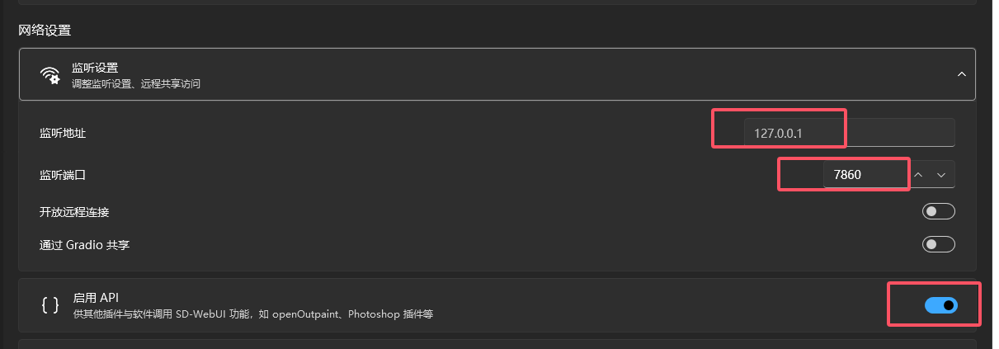
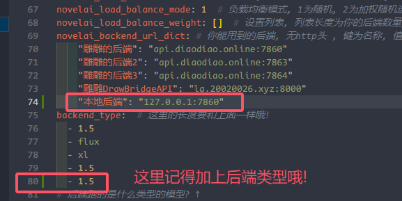

目前插件正处于快速迭代阶段，功能随时可能增加，也随时可能废弃，如果你发现之前的设置不起作用，请回到本页查看最新内容
# 需要注意的插件配置文件路径
#### 配置文件路径 机器人所在路径/config/novelai/config.yaml
- [配置文件](../../nonebot_plugin_stable_diffusion_diao/config_example.yaml)
#### DrawBridgeAPI默认配置文件路径  机器人所在路径/config/dbapi_config.yaml
- [DBAPI](./DrawBridgeAPI.md) (DBAPI启动时会自动将自己添加到后端列表里, 不需要再额外配置)

# 后端准备
## 秋叶启动器 / 使用自己的API
  
请注意, API选项一定要打开, 然后我们记住端口和地址, 这里为(127.0.0.1:7860)  

- [修改画图后端](#novelai_backend_url_dict)  

  
## 使用LibLibAI / DrawBridgeAPI  
### 插件默认打开DBAPI, 不需要手动添加到后端字典里面, 需要根据以下来修改配置文件设置token↓

- [DBAPI](./DrawBridgeAPI.md)

## 不进行设置, 使用雕雕后端 (开箱即用)
### la.20020026.xyz:8000 (DBAPI)
### api.diaodiao.online:7860 (SD-WEBUI)
### 下面是一份配置文件(ENV)的示例，包含了 nonebot 自带的配置
### 注意 COMMAND_START=["/","","#"] , 需要这个机器人才能响应命令
```
HOST=127.0.0.1
PORT=8081
LOG_LEVEL=DEBUG
FASTAPI_RELOAD=false

# 以下和本插件相关
SUPERUSERS=[""]  # 配置 NoneBot 超级用户
NICKNAME=["Mutsuki"]  # 配置机器人的昵称
COMMAND_START=["/","","#"]  # 配置命令起始字符  # 机器人响应什么开头的命令, 如此例子, 响应 /绘画 ; 绘画 ; #绘画
```

## 需要留意的配置项(插件默认配置已经为你配置好了, 可以启动即画, 如果你想要使用自己的API的话, 请留意以下配置)
### 以下配置config.yaml中均有备注
- [修改画图后端](#novelai_backend_url_dict)
- [修改后端模型类型(1.5/XL/FLUX)](#backend_type)
### 如果我有两个后端, 1号后端性能比较差, 我希望它绘图的时候使用较低的步数, 2号后端性能强大, 我想要设置比较高的分辨率, 应该怎么办呢?
- [分别为各个后端设置参数](#override_backend_setting)
### 如果你跑机器人的机器配置不错(2G内存双核CPU即可;CPU审核,速度还算可观), 可以设置2使用本地的审核(需要安装新的依赖和下载模型300MB)
- [设置本地审核](#novelai_picaudit)
### 为了增加趣味性, 插件提供了一些参数的随机功能
- [随机画幅比例](#novelai_random_ratio)
### 关于高清修复
#### novelai_hr: false  # 推荐设置为false, 是否启动高清修复, 这个设置是全局打开高清修复, 缺乏一定灵活性, 请看以下例子

```yaml
override_backend_setting:
  - 
    "tags": "<lora:flux-test-lora16G-fb:1>,<lora:flux-test-lora16G-taya:1>"
    "steps": 4
    "disable_hr": true  # 全局关闭高清修复(优先级最高)
  
  - 
    "tags": "score_9,score_8_up,score_7_up,score_anime,"
    "ntags": "score_3,poorly drawn,bad anatomy,bad proportions, watercolor painting, brush strokes,3d,2.5d,signature,watermark,bad face,distorted face,messed up eyes,deformed,(low quality, bad quality, worst quality:1.2),bad hand"
    "hiresfix_scale": 1.2  # 默认使用1.2倍高清修复, 可以通过 -hr_off 参数关闭
    "steps": 20
  
  - 
    "tags": "best quality, masterpiece (quality)"
    "ntags": "worst quality, comic, multiple views, bad quality, low quality, lowres, displeasing, very displeasing, bad anatomy, bad hands, scan artifacts, monochrome, greyscale, signature, twitter username, jpeg artifacts, 2koma, 4koma, guro, extra digits, fewer digits"
    "steps": 20  # 默认不使用高清修复, 但是可以手动启用(通过 -hr 1.2 参数来进行1.2倍修复)
```
## ↓ 由于本插件是个较大项目, 所以请仔细阅读,指令示例, 快看快看快看, 一定要仔细看哦 ↓ 
### 发送 绘画帮助 , 获取详细帮助
[各种指令展示](nonebot_plugin_stable_diffusion_diao/extension/ADH.md)


# 完整配置详解↓ - [配置文件](../../nonebot_plugin_stable_diffusion_diao/config_example.yaml)
### novelai_mj_proxy

- 类型: **字符串**
- 默认值: **""**

Midjourney代理地址，当使用 Midjourney 功能时必须填写。参考项目 [midjourney-proxy](https://github.com/novicezk/midjourney-proxy)。

---

### novelai_mj_token

- 类型: **字符串**
- 默认值: **""**

Midjourney 的鉴权 token，选填。

---

### bing_key

- 类型: **字符串|null**
- 默认值: **null**

Bing 翻译功能的 API Key。

---

### deepl_key

- 类型: **字符串|null**
- 默认值: **null**

DeepL 翻译功能的 API Key。

---

### baidu_translate_key

- 类型: **对象**
- 默认值: **{"SECRET_KEY": "", "API_KEY": ""}**

百度翻译的 API Key，包含 `SECRET_KEY` 和 `API_KEY`。可以在 [百度云机器翻译](https://console.bce.baidu.com/ai/?_=1685076516634#/ai/machinetranslation/overview/index) 控制台获取。

---

### novelai_tagger_site

- 类型: **字符串**
- 默认值: **api.diaodiao.online:7865**

分析功能的地址，用于处理图像标注等任务。例如：`127.0.0.1:7860`。

---

### tagger_model

- 类型: **字符串**
- 默认值: **wd14-vit-v2-git**

分析功能和审核功能使用的模型名称。

---

### vits_site

- 类型: **字符串**
- 默认值: **api.diaodiao.online:5877**

VITS 模型的运行地址。

---

### novelai_pic_audit_api_key

- 类型: **对象**
- 默认值: **{"SECRET_KEY": "", "API_KEY": ""}**

百度云用于图片审核功能的 API Key，包含 `SECRET_KEY` 和 `API_KEY`。

---

### openai_api_key

- 类型: **字符串**
- 默认值: **""**

如果你想使用 ChatGPT 的 prompt 生成功能，请填写你的 OpenAI API Key。

---

### openai_proxy_site

- 类型: **字符串**
- 默认值: **api.openai.com**

使用代理时填写的 OpenAI API 地址。

---

### proxy_site

- 类型: **字符串**
- 默认值: **""**

用于访问 C 站、OpenAI、翻译等功能的 HTTP 代理地址。请填写完整的 URL，例如 `http://192.168.5.1:11082`。

---

### trans_api

- 类型: **字符串**
- 默认值: **api.diaodiao.online:50000**

自建翻译 API 的地址。

---

### redis_host

- 类型: **列表**
- 默认值: **["127.0.0.1", 6379]**

Redis 服务的主机地址和端口，默认是 `127.0.0.1` 和端口 `6379`。

---

### bing_cookie

- 类型: **列表**
- 默认值: **[]**

Bing 的 cookie 列表，已失效，由于原项目不再维护，此功能不可使用。

---

### dbapi_site

- 类型: **列表**
- 默认值: **["127.0.0.1", 8000]**

SD-DrawBridgeAPI 的地址和端口，用于模型管理和任务操作。

---

### dbapi_conf_file

- 类型: **字符串**
- 默认值: **'./config/dbapi_config.yaml'**

SD-DrawBridgeAPI 的配置文件路径。

### novelai_antireport

- 类型: **布尔值**
- 默认值: **true**

玄学选项。开启后，合并消息中的发送者将会显示为调用指令的人，而不是机器人。

---

### novelai_on

- 类型: **布尔值**
- 默认值: **true**

控制全局是否开启画图功能。

---

### novelai_save_png

- 类型: **布尔值**
- 默认值: **false**

是否保存图片为 PNG 格式。

---

### novelai_pure

- 类型: **布尔值**
- 默认值: **true**

是否启用简洁返回模式。启用后，只返回图片，不返回 tag 等数据。

---

### novelai_extra_pic_audit

- 类型: **布尔值**
- 默认值: **true**

是否为 ChatGPT 生成的 tag 等功能添加审核功能，适用于二次元内容。

---

### run_screenshot

- 类型: **布尔值**
- 默认值: **false**

是否获取服务器的屏幕截图。

---

### is_redis_enable

- 类型: **布尔值**
- 默认值: **true**

是否启动 Redis。启用 Redis 可以获得更多功能。

---

### auto_match

- 类型: **布尔值**
- 默认值: **true**

是否自动匹配设置，例如根据标签自动匹配相关内容。

---

### hr_off_when_cn

- 类型: **布尔值**
- 默认值: **true**

使用 ControlNet 功能时，是否关闭高清修复。

---

### only_super_user

- 类型: **布尔值**
- 默认值: **true**

是否仅允许超级用户永久更换模型。

---

### tiled_diffusion

- 类型: **布尔值**
- 默认值: **false**

是否使用 tiled-diffusion 来生成图片。

---

### save_img

- 类型: **布尔值**
- 默认值: **true**

是否在 API 侧保存生成的图片。

---

### openpose

- 类型: **布尔值**
- 默认值: **false**

是否使用 OpenPose 来生成图片，减少肢体崩坏的概率。

---

### sag

- 类型: **布尔值**
- 默认值: **false**

每张图片使用 Self Attention Guidance 来生成，可一定程度上提升图片质量。

---

### negpip

- 类型: **布尔值**
- 默认值: **false**

负面提示词用法。允许在提示词中添加类似 `(black:-1.8)` 以减少不想要的元素。

---

### zero_tags

- 类型: **布尔值**
- 默认值: **false**

当发送绘画命令时未提供提示词，是否自动生成随机提示词进行绘图。

---

### show_progress_bar

- 类型: **列表**
- 默认值: **[false, 2]**

是否显示进度条。第一个参数控制是否显示，第二个参数为显示频率。

---

### is_trt_backend

- 类型: **布尔值**
- 默认值: **false**

是否使用 TensorRT 后端。开启此选项时，分辨率必须为 64 的倍数，系统会自动调整分辨率和高清修复倍率。

---

### is_return_hash_info

- 类型: **布尔值**
- 默认值: **false**

是否返回图片的哈希信息，避免被群管家撤回图片。

---

### auto_dtg

- 类型: **布尔值**
- 默认值: **false**

当 prompt 少于 10 时，是否自动启用 dtg 功能来补全 tag，同时适用于二次元内容。

---

### ai_trans

- 类型: **布尔值**
- 默认值: **false**

是否启用 AI 自动翻译或生成功能。

---

### dbapi_build_in

- 类型: **布尔值**
- 默认值: **true**

是否启动内置的 SD-DrawBridgeAPI 来生成图片。

---

### send_to_bot

- 类型: **布尔值**
- 默认值: **true**

当生成涩图时，是否直接发送给机器人本身，避免未配置超级用户时出现问题。

---

### enable_txt_audit

- 类型: **布尔值**
- 默认值: **false**

是否启用 LLM 文本审核功能。

---

### reload_model

- 类型: **布尔值**
- 默认值: **false**

是否自动重新加载 Lora/Emb 模型。

### novelai_save

- 类型: **整数**
- 默认值: **2**

是否保存图片至本地:
- 0：不保存。
- 1：保存图片。
- 2：保存图片及追踪信息。

---

### novelai_daylimit_type

- 类型: **整数**
- 默认值: **2**

限制模式选择:
- 1：按张数限制。
- 2：按画图所用时间计算（推荐）。

---

### novelai_htype

- 类型: **整数**
- 默认值: **1**

涩图处理方式:
- 1：发现 H 图后私聊用户返回图片。
- 2：返回群消息，仅返回图片 URL，主人直接私吞 H 图。
- 3：发送二维码（无论参数如何都会保存图片到本地）。
- 4：不发送涩图。

---

### novelai_h

- 类型: **整数**
- 默认值: **2**

涩涩 prompt 检测，是否允许 H 图:
- 0：不允许。
- 1：删除屏蔽词。
- 2：允许（推荐使用图片审核功能）。

---

### novelai_picaudit

- 类型: **整数**
- 默认值: **4**

图片审核方式:
- 1：百度云图片审核。
- 2：本地审核功能。
- 3：关闭审核。
- 4：使用 webui 的 API，地址为 `novelai_tagger_site` 设置的。

---

### tagger_model_path

- 类型: **字符串**
- 默认值: `'SmilingWolf/wd-v1-4-convnextv2-tagger-v2'`

本地审核模型路径或仓库路径。

---

### novelai_todaygirl

- 类型: **整数**
- 默认值: **1**

两种不同的方式选择:
- 1：方式一。
- 2：方式二。

---

### novelai_load_balance

- 类型: **布尔值**
- 默认值: **true**

负载均衡是否启用，使用前需要关闭队列限速，目前只支持 `stable-diffusion-webui`，且仅在 `novelai_mode = "sd"` 时可用。

---

### novelai_load_balance_mode

- 类型: **整数**
- 默认值: **1**

负载均衡模式:
- 1：随机选择后端。
- 2：加权随机选择后端。

---

### novelai_load_balance_weight

- 类型: **列表**
- 说明: 列表中的每个值代表后端的随机权重，长度必须与后端数量一致。例如 `[0.2, 0.5, 0.3]`。

---

### novelai_backend_url_dict

- 类型: **字典**
- 默认值: 
```yaml
    "雕雕的后端": "api.diaodiao.online:7860"
    "雕雕的后端2": "api.diaodiao.online:7863"
    "雕雕的后端3": "api.diaodiao.online:7864"
    "雕雕DrawBridgeAPI": "la.20020026.xyz:8000"
```

你能够使用的后端地址，键为后端名称，值为后端的 URL（无 HTTP 头）。

---

### backend_type

- 类型: **列表**
- 默认值: **`[1.5, flux, xl, 1.5]`**

后端跑的模型类型，长度必须与 `novelai_backend_url_dict` 一致。

---

### override_backend_setting_enable

- 类型: **布尔值**
- 默认值: **false**

是否启用后端设置覆写功能，覆写功能的长度必须与后端字典长度一致。

---

### override_backend_setting

- 类型: **列表**
- 用于覆写后端的初始化设置参数，可以设置 `tags`、`ntags`、`scale`、`steps`、`sampler` 等，支持多个配置。

例如：
```
# 支持覆写的参数
"tags": ""  #
"ntags": ""
"seed": null
"scale": null  # cfg scale
"steps": null  
"strength": null  # denoize_strength
"noise": null  # 
"man_shape": null  # 画布形状/分辨率 例: 512x768  / p
"sampler": null  # 采样器
"backend_index": null  # 后端索引
"disable_hr": false  # 关闭高清修复
"hiresfix_scale": null  # 高清修复倍率
"event": null
"sr": null  # 超分/支持输入 ['fast']/['slow']
"model_index": null  # 模型索引
"custom_scripts": null
"scripts": null
"td": null  # tilled diffusion
"xyz_plot": null
"open_pose": false  
"sag": false
"accept_ratio": null  # 画幅比例 '2:3'
"outpaint": false
"cutoff": null
"eye_fix": false  # ad修复器
"pure": false  # 纯净模式
"xl": false 
"dtg": false 
"pu": false
"ni": false+
"batch": 1  # 每批张数
"niter": 1  # 批数
"override": false,
"model": null  # 使用的模型

```

```yaml
- tags: ""
  ntags: "easynegative"
  scale: 7
  steps: 16
  sampler: Euler a
- steps: 4
  model: null
- tags: "score_9..."
  ntags: "score_3..."
```

### post 参数设置

---

### novelai_tags

- 类型: **字符串**
- 默认值: **""**

内置的 tag (标签)，推荐使用 `override_backend_setting` 来为不同的后端单独设置。

---

### novelai_ntags

- 类型: **字符串**
- 默认值: **"easynegative"**

内置的反 tag (负面标签)。

---

### novelai_steps

- 类型: **整数**
- 默认值: **null**

生成图像的默认步数。

---

### novelai_max_steps

- 类型: **整数**
- 默认值: **36**

生成图像的最大步数限制。

---

### novelai_scale

- 类型: **整数**
- 默认值: **7**

CFG Scale，用于调节图像生成时的控制强度，每个模型的适用值可能不同。

---

### novelai_random_scale

- 类型: **布尔值**
- 默认值: **false**

是否开启随机 CFG Scale。

---

### novelai_random_scale_list

- 类型: **列表**

随机 CFG Scale 列表，包含每个 scale 值及其出现的概率。例如：
```yaml
- - 5
  - 0.4
- - 6
  - 0.4
- - 7
  - 0.2
```

---

### novelai_random_ratio

- 类型: **布尔值**
- 默认值: **true**

是否开启随机比例。

---

### novelai_random_ratio_list

- 类型: **列表**

随机比例列表，每个比例值和其对应的概率。例如：
```yaml
- - p
  - 0.7  # 70%概率随机到 p , 即为人像构图
- - s
  - 0.1
- - l
  - 0.1
- - uw
  - 0.05
- - uwp
  - 0.05
```

---

### novelai_random_sampler

- 类型: **布尔值**
- 默认值: **false**

是否开启随机采样器。

---

### novelai_random_sampler_list

- 类型: **列表**

随机采样器列表，每个采样器和其对应的概率。例如：
```yaml
- - Euler a
  - 0.9
- - DDIM
  - 0.1
```

---

### novelai_sampler

- 类型: **字符串**
- 默认值: **null**

默认采样器，如果不设置，则默认使用 `Euler a`。`Euler a` 更适合画人物，而 `DDIM` 系采样器适合生成丰富的背景，`DPM` 系采样器速度较慢，需自行尝试。

---

### novelai_hr

- 类型: **布尔值**
- 默认值: **true**

是否启动高清修复。

---

### novelai_hr_scale

- 类型: **浮点数**
- 默认值: **1.5**

高清修复时的放大比例。

---

### novelai_hr_payload

高清修复的详细设置：

```yaml
enable_hr: true  # 启用高清修复
denoising_strength: 0.4  # 重绘幅度
hr_scale: 1.5  # 高清修复比例
hr_upscaler: "R-ESRGAN 4x+ Anime6B"  # 超分模型
hr_second_pass_steps: 7  # 高清修复步数
```

---

### novelai_SuperRes_MaxPixels

- 类型: **整数**
- 默认值: **2000**

超分辨率最大像素值，对应的是 `(值)^2`。限制超高分辨率图像的生成，防止显存爆炸。

---

### novelai_SuperRes_generate

- 类型: **布尔值**
- 默认值: **false**

图片生成后是否再次进行超分辨率处理。

---

### novelai_SuperRes_generate_way

- 类型: **字符串**
- 默认值: **"fast"**

超分模式，可选值为 `fast` 和 `slow`。`slow` 模式使用 `Ultimate SD upscale` 脚本。

---

### novelai_SuperRes_generate_payload

超分处理的详细设置：

```yaml
upscaling_resize: 1.2  # 超分倍率
upscaler_1: "Lanczos"  # 第一次超分使用的方法
upscaler_2: "R-ESRGAN 4x+ Anime6B"  # 第二次超分使用的方法
extras_upscaler_2_visibility: 0.6  # 第二层 upscaler 的力度
```

---

### novelai_ControlNet_post_method

- 类型: **整数**
- 默认值: **0**

`ControlNet` 后处理方法的选择。

---

### control_net

- 类型: **列表**

`ControlNet` 模型列表，用于生成时指定模型。

例如：
```yaml
- "lineart_anime"
- "control_v11p_sd15s2_lineart_anime [3825e83e]"
```

---

### xl_config

SDXL 模型的配置项：

```yaml
sd_vae: "sdxl_vae.safetensors"
prompt: ""
negative_prompt: ""
hr_config:         
  denoising_strength: 0.7
  hr_scale: 1.5
  hr_upscaler: "Lanczos"
  hr_second_pass_steps: 10
xl_base_factor: 1.5  # XL 模型基础分辨率放大倍数
```

### novelai_command_start

- 类型: **列表**

机器人响应的命令列表。用户发送的命令中包含这些关键词时，机器人会触发绘图功能。例如：
```yaml
- "绘画"
- "咏唱"
- "召唤"
- "约稿"
- "aidraw"
- "画"
- "绘图"
- "AI绘图"
- "ai绘图"
```

---

### novelai_retry

- 类型: **整数**
- 默认值: **4**

post 请求失败后重试的次数。

---

### novelai_daylimit

- 类型: **整数**
- 默认值: **24**

每日画图次数的限制，0 表示不限制。

---

### novelai_cd

- 类型: **整数**
- 默认值: **60**

默认的冷却时间 (单位：秒)，每次生成图像后的等待时间。

---

### novelai_group_cd

- 类型: **整数**
- 默认值: **3**

群聊中的共享冷却时间 (单位：秒)，表示多人群体绘图功能的冷却时间。

---

### novelai_revoke

- 类型: **整数**
- 默认值: **0**

是否自动撤回生成的消息，值为 0 表示不撤回。非 0 时，表示撤回的时间间隔（单位：秒）。

---

### novelai_size_org

- 类型: **整数**
- 默认值: **640**

图片生成的最大分辨率 (单位：像素)，对应的总分辨率为 `(值)^2`。  
默认最大值为 1024x1024。对于服务器性能较低的情况，建议将其调整为 640x640 或根据实际承受能力进行设置。