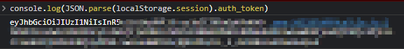
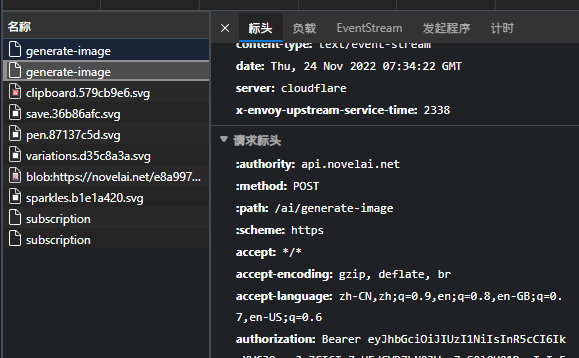

# 使用NovelAI

## 首先,登录https://novelai.net/image, 获取你的token

获取方式如下：

1. 通过代码获取：
1. 在网页中登录你的 NovelAI 账号
1. 打开控制台 (F12)，并切换到控制台 (Console) 标签页
1. 输入下面的代码并按下回车运行

```js
console.log(JSON.parse(localStorage.session).auth_token);
```

4. 你会看到如下的输出，这部分就是你的 token  

5. 通过抓包获取:
6. 在网页中登录你的 NovelAI 账号
7. 打开控制台 (F12)，并切换到网络 (Network) 标签页
8. 随便生成一个什么东西，你会看到左侧多了两个 generate-image 的请求，点击下面那个，右侧会弹出它的信息
9. 在标头 (Header) 一栏中寻找 authorization 一项，你会看到类似以 Bearer 开头的一长串字符
10. 在 Bearer 后面的一长串就是你的 token，如果没有就在另一个请求里找  


## 更改配置文件
- 在机器人目录/config/novelai/config.yaml中找到
```
dbapi_build_in: true  # 设置为true, 我们需要它来转发绘图请求
```
- 在机器人目录/config/dbapi_config.yaml中找到 (如果第一次打开dbapi_build_in,会自己创建, 重启机器人更改即可)
```
novelai_setting:
  token:
    - eyJhbGciOi...  # 把你刚刚找到的token填在这里
    - 如果你有多个token, 可以在这里添加第二个
  model:
    - nai-diffusion-3
    - nai-diffusion-3
```
- 再找到

```
server_settings:
  # 重点! 需要启动的后端, 有些后端你没配置的话依然启动会导致API报错（虽然API会将它锁定，之后请求就不会到它）
  # 怎么数呢？ 比如在这个配置文件中 civitai 的第一个token是 0 a1111 的第一个后端是 1 , 第二个是2
  # 所以 enable_txt2img_backends: [0,1] 表示启动 civitai第一个token 和 a1111的第一个后端
  # 再比如 enable_txt2img_backends: [3, 4, 5] 表示启动 liblib 的所有两个token 和 tusiart的第一个token
  enable_txt2img_backends: [12]
  enable_img2img_backends: [1]
  enable_sdapi_backends: [1]
```
- 设置enable_txt2img_backends为[12] (默认状态下) 以启动novelai绘图,如果有2个token, 即为[12,13]
### 为什么这样/更多设置请看 [DBAPI](./DrawBridgeAPI.md)

- 重启机器人, DBAPI会出现在你的最后一个后端, 之后就可以使用它进行绘图了